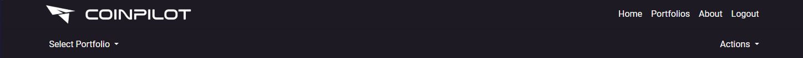

# CoinPilot


## Introduction

CoinPilot is a crypto portfolio tracker. CoinPilot has been developed as part of the Code Institute's Full-Stack Developer course as my 4th project—focusing on Django and Bootstrap frameworks, database manipulation, and CRUD functionality. It is for educational purposes only.

View the live site here: [CoinPilot](https://coinpilot-22489aa60f63.herokuapp.com/)

For Admin access with relevant sign-in information: [CoinPilot Admin](https://coinpilot-22489aa60f63.herokuapp.com/admin/)

<hr>

## Table of Contents

- [CoinPilot](#coinpilot)
  - [Introduction](#introduction)
  - [Table of Contents](#table-of-contents)
  - [Overview](#overview)
- [UX - User Experience](#ux---user-experience)
  - [Design Inspiration](#design-inspiration)
    - [Colour Scheme](#colour-scheme)
    - [Font](#font)
- [Project Planning](#project-planning)
  - [Strategy Plane](#strategy-plane)
    - [Site Goals](#site-goals)
  - [Agile Methodologies - Project Management](#agile-methodologies---project-management)
    - [MoSCoW Prioritization](#moscow-prioritization)
  - [User Stories](#user-stories)
    - [Visitor User Stories](#visitor-user-stories)
    - [Epic - User Profile](#epic---user-profile)
    - [Epic - Portfolio Management](#epic---portfolio-management)
    - [Epic - Market Data](#epic---market-data)
    - [Epic - Alerts](#epic---alerts)
  - [Scope Plane](#scope-plane)
  - [Skeleton \& Surface Planes](#skeleton--surface-planes)
    - [Wireframes](#wireframes)
    - [Database Schema - Entity Relationship Diagram](#database-schema---entity-relationship-diagram)
    - [Security](#security)
- [Features](#features)
  - [User View - Registered/Unregistered](#user-view---registeredunregistered)
  - [CRUD Functionality](#crud-functionality)
  - [Feature Showcase](#feature-showcase)
  - [Future Features](#future-features)
- [Technologies \& Languages Used](#technologies--languages-used)
  - [Libraries \& Frameworks](#libraries--frameworks)
  - [Tools \& Programs](#tools--programs)
- [Testing](#testing)
- [Deployment](#deployment)
  - [Connecting to GitHub](#connecting-to-github)
  - [Django Project Setup](#django-project-setup)
  - [Cloudinary API](#cloudinary-api)
  - [Elephant SQL](#elephant-sql)
  - [Heroku Deployment](#heroku-deployment)
- [Credits](#credits)
  - [Code](#code)
  - [Media](#media)
    - [Additional Reading/Tutorials/Books/Blogs](#additional-readingtutorialsbooksblogs)
  - [Acknowledgements](#acknowledgements)

  ## Overview

CoinPilot is a crypto portfolio tracker. Users are invited to:

- Join CoinPilot
- Create and manage their own portfolios
- Track their cryptocurrency investments
- View real-time market data
- Analyze their portfolio holding and single trade performance

CoinPilot is accessible via all browsers with full responsiveness on different screen sizes. Its aim is to provide a comprehensive tool for cryptocurrency investors to manage their portfolios efficiently and stay informed about market trends. I have created this site to meet the needs of the growing cryptocurrency investment community. With the rising popularity of cryptocurrencies, investors require reliable tools for tracking their investments, analyzing market data, and making informed decisions.

CoinPilot aims to offer a centralized platform where users can manage their crypto investments, receive critical updates, and interact with a community of like-minded investors. In future development of this project, I hope to offer users advanced features such as portfolio optimization suggestions, integration with multiple exchanges, and additional analytics tools. Other features will include enhanced security measures, personalized investment advice, and investing strategy testing.

# UX - User Experience

## Design Inspiration

I was really excited to work on this project's frontend as I had a clear vision of the final product from the beginning. I aimed to create a website with a clean and modern design that emphasizes usability and clarity. The interface is designed to be intuitive, with a focus on functionality and ease of navigation. The color scheme was chosen to create a professional and modern feel, using shades of purple and white.

Original inspiration came from financial dashboards and modern fintech applications. I wanted to create an interactive, data-driven website with a cohesive visual identity.

### Colour Scheme

As mentioned above, the color scheme and logo drove the design of the website. I wanted to create a professional and trustworthy environment for the user to manage their cryptocurrency investments. The colors represent different sections/features of the website. I balanced the subtle shades with a classic, `#F8F7F7` white background and a dark purple shade of `#1D1A24`, as I felt that it yielded a slightly more matte effect than `#000` black. This combination also yielded a high contrast ratio for accessibility, with my color scheme also passing a Color Blind Safe check via [Adobe Color](https://color.adobe.com/create/color-wheel). This check was important for accessibility as the colors form the base for my page and feature icons. Each color in the scheme was also contrast checked with dark purple `#1D1A24` to ensure no contrast issues, and all passed.

The corresponding sections and colors and identifying CSS variables are:

- Navigation: `#1D1A24` '--dark-purple'
- Accent: `#79627B` '--accent-purple'
- Background: `#F8F7F7` '--white'
- Text: `#FFFFFF` or `#1D1A24` '--white' or '--dark purple' depending on the background
- Data Tables: `#868B94` '--grey' (used for zebra striping)

For the login/logout icon, a grey `#868B94` was used as a base color. I felt this grey helped to balance the colors and prevent the icons from 'popping' too much for the eye in the navigation bar.

  
*Color Scheme for CoinPilot website*

  
*Accessibility check for color scheme*

### Font

Using [Google Fonts](https://fonts.google.com/), I imported 'Roboto' as the main font to my CSS file. Roboto is a modern, clean sans-serif which I felt worked well in designing my logo and for all text elements in my project. Its readability and professional appearance make it suitable for a financial application like CoinPilot. For future use, I envisioned merchandise bearing the logo for the CoinPilot brand.

  
*Roboto, a Google Font designed by Christian Robertson*

# Project Planning

## Strategy Plane

The project goal was to build a comprehensive crypto portfolio tracker. The 'product' was a platform where users could track their cryptocurrency investments, and the 'users' were crypto investors, traders, and enthusiasts. Given the complexity of cryptocurrency investments, I aimed to create an easy-to-use, intuitive platform for users. Through planning and design preparation, I realized there was an opportunity to extend this service into a more robust tool with social elements, allowing users to share insights and strategies.

### Site Goals

- Provide a reliable and comprehensive tool for cryptocurrency investors
- Use of a professional color scheme to convey trust and stability
- Incorporate commonly-used, identifiable icons with a sleek design to fit the financial theme
- Ensure an easy UI for quick fulfillment of feature CRUD functionalities
- Maintain a consistent UX across mobile, tablet, and desktop devices
- Develop a scalable platform that can easily incorporate future features and integrations, such as portfolio optimization suggestions and integration with multiple exchanges

## Agile Methodologies - Project Management

CoinPilot is my first project following Agile planning methods. As someone who loves to prepare and plan, it was a joy to get to know and use. I used my [GitHub Projects Board](https://github.com/users/equaynor/projects/2/views/1) to plan and document all of my work.

### MoSCoW Prioritization

I chose to follow the MoSCoW Prioritization method for CoinPilot, identifying and labeling my:

- **Must Haves**: the 'required', critical components of the project. Completing my 'Must Haves' helped me to reach the MVP (Minimum Viable Product) for this project early, allowing me to develop the project further than originally planned.
  
- **Should Haves**: the components that are valuable to the project but not absolutely 'vital' at the MVP stage. The 'Must Haves' must receive priority over the 'Should Haves'.
  
- **Could Haves**: these are the features that are a 'bonus' to the project. It would be nice to have them in this phase, but only if the most important issues have been completed first and time allows.
  
- **Won't Haves**: the features or components that either no longer fit the project's brief or are of very low priority for this release.

## User Stories

User stories and features recorded and managed on [GitHub Projects](<https://github.com/users/equaynor/projects/2>)

### Visitor User Stories

| User Story | Priority |
|----------------------------------------------------------------------------------------------------------------------------|---------------|
| As a **user**, I want to be able to **view the website's home page** so that I can **learn about it and the services it offers** | **MUST HAVE** |
| As a **user**, I can **find the website's navigation area** so that I **may easily navigate around the website** | **MUST HAVE** |
| As a **user**, I can **view any error pages with a 'Home' button** so that I **can get back to the homepage easily** | **MUST HAVE** |
| As a **user**, I want **to see a message when I have successfully/unsuccessfully completed an action** so that I can **receive feedback from my interaction with the website** | **MUST HAVE** |

### Epic - User Authentication and Authorization

| User Story | Priority |
|----------------------------------------------------------------------------------------------------------------------------|---------------|
| As a **user**, I want to be able to **register with the application using my email and password** so that I can **create an account** | **MUST HAVE** |
| As a **user**, I want to be able to **log in to the application using my credentials** so that I can **access my portfolio and other features** | **MUST HAVE** |
| As a **user**, I want to be able to **log out of the application** so that my **account remains secure** | **MUST HAVE** |
| As an **admin**, I want to be able to **create, read, update, and delete user accounts** so that I can **manage the application's users** | **SHOULD HAVE** |
| As an **admin**, I want to be able to **assign roles (admin or regular user) to users** so that I can **control their access and permissions** | **COULD HAVE** |

### Epic - Cryptocurrency Data Integration

| User Story | Priority |
|----------------------------------------------------------------------------------------------------------------------------|---------------|
| As a **user**, I want to be able to **view a list of supported cryptocurrencies with their real-time market data (price, market cap, etc.)** so that I can **make informed decisions** | **MUST HAVE** |
| As an **admin**, I want to be able to **add or remove cryptocurrencies from the supported list** so that I can **keep the application up-to-date with the latest cryptocurrencies** | **COULD HAVE** |

### Epic - Portfolio Management

| User Story | Priority |
|----------------------------------------------------------------------------------------------------------------------------|---------------|
| As a **user**, I want to be able to **create a new cryptocurrency portfolio** so that I can **start tracking my investments** | **MUST HAVE** |
| As a **user**, I want to be able to **view a summary of my portfolio, including the total value and the breakdown of holdings** so that I can **monitor my investments** | **MUST HAVE** |
| As a **user**, I want to be able to **see the profit/loss of each holding, as well as the overall portfolio** | **MUST HAVE** |
| As a **user**, I want to be able to **update the details of my portfolio (name, description, etc.)** so that I can **keep my information accurate** | **SHOULD HAVE** |
| As a **user**, I want to be able to **delete a portfolio** so that I can **remove any unwanted portfolios** | **MUST HAVE** |

### Epic - Holdings

| User Story | Priority |
|----------------------------------------------------------------------------------------------------------------------------|---------------|
| As a **user**, I want to be able to **open each holding and see all related information like trades of that coin, profit/loss, holding period** so that I can **have a detailed overview of my investments** | **MUST HAVE** |

### Epic - Trade Tracking

| User Story | Priority |
|----------------------------------------------------------------------------------------------------------------------------|---------------|
| As a **user**, I want to be able to **add a new trade (buy or sell) for a specific cryptocurrency in my portfolio** so that I can **track my investment activity** | **MUST HAVE** |
| As a **user**, I want to be able to **view the trade history for each cryptocurrency in my portfolio** so that I can **analyze my investment performance** | **MUST HAVE** |
| As a **user**, I want to be able to **update the details of an existing trade (quantity, price, etc.)** so that I can **correct any mistakes or inaccuracies** | **MUST HAVE** |
| As a **user**, I want to be able to **delete a trade from my portfolio** so that I can **remove any unwanted or erroneous trades** | **MUST HAVE** |
| As a **user**, I want to be able to **see the profit/loss for each trade and my overall portfolio** so that I can **evaluate my investment performance** | **COULD HAVE** |

### Epic - User Interface

| User Story | Priority |
|----------------------------------------------------------------------------------------------------------------------------|---------------|
| As a **user**, I want to have a **visually appealing and responsive user interface** so that I can **easily navigate and use the application on different devices** | **MUST HAVE** |
| As a **user**, I want to be able to **view charts and visualizations of my portfolio performance** so that I can **better understand my investment trends** | **SHOULD HAVE** |
| As a **user**, I want to be able to **easily access and view cryptocurrency market data** so that I can **make informed decisions about my investments** | **MUST HAVE** |

## Scope Plane

As this would be a dual learning/building project using technologies that were new to me, such as Django, SQL, Bootstrap, and Cloudinary, I was cautious to maintain consistent control over the scope of the project and not let my idea grow too big. With the sheer amount of files, I needed to lock down my project features early on into manageable blocks so as not to lose track of the MVP. Following my learning of the Django MVT framework, I was able to identify how to change the templated structure to produce different website features from my base HTML. This allowed me to build upon my original idea of a 'Crypto Portfolio Tracker' and add additional functionalities, such as real-time market data integration and trade tracking.

Following Agile Planning Methodologies, I added my Developer Tasks, and User Stories as issues on my [GitHub project board](https://github.com/users/equaynor/projects/2). However, I didn't create any sprints since, during the project, my third child was born and everything was a little chaotic.

Essential features of my project were:

- A professional, accessible website that fulfills user needs
- Responsive website for users of mobile, tablet, and desktop devices
- User Authentication and Authorization
- User Portfolio creation and editing
- Cryptocurrency data integration with real-time market data
- Portfolio management with full CRUD functionality
- Trade tracking with full CRUD functionality
- Detailed visualization and analysis of portfolio performance

Planning my project thoroughly from the start allowed me to identify areas of importance for MVP completion and satisfaction of assessment criteria, and to balance them with the feasibility of the features.

## Skeleton & Surface Planes

### Wireframes

The wireframes for CoinPilot were created by hand, focusing on simplicity and clarity. Given the scope of the project and my time constraints, I decided to keep the wireframes straightforward and only for desktop. Initially, I considered incorporating some nice animations and UI effects, but I quickly realized it would exceed the project's scope.

**Desktop view for:**

- Home
- Signup
- Portfolio
- Coin List

By keeping the wireframes simple, I was able to maintain a clear vision of the essential features and ensure a functional MVP. Below are the wireframes for each of the main pages:

<details open>
    <summary>Desktop Home Page Wireframe</summary>  
      
</details>

<details>
    <summary>Desktop Login Page Wireframe</summary>  
    
</details>

<details>
    <summary>Desktop Portfolio Page Wireframe</summary>  
    
</details>

<details>
    <summary>Desktop Coin List Page Wireframe</summary>  
    
</details>

Creating these wireframes helped me to visualize the layout and user flow of the application, ensuring that the design remained user-friendly and functional. While I initially planned for more advanced UI elements, focusing on a basic, clean design allowed me to deliver a coherent and usable product.

I look forward to iterating on these designs and incorporating more advanced features and animations in future versions of CoinPilot.

### Database Schema - Entity Relationship Diagram

  
*Database Schema (ERD) for CoinPilot displaying relationships between feature components saved within the database*

This Entity Relationship Diagram (ERD) demonstrates how each feature interacts with each other and the connected PostgreSQL Database. Using Django's User Model and Django AllAuth to carry out all user authentication, a `user_id` is created when the user registers with their email and password. This allows the user to create and manage their portfolios, holdings, and trades within the application.

The schema is structured as follows:

- Each **user** can have multiple **portfolios**.
- Each **portfolio** can have multiple **holdings**.
- Each **holding** can have multiple **trades**.
- Each **trade** and each **holding** is associated with one specific **coin**.

For instance, when a user creates a new portfolio, they can add multiple holdings to it, each representing a different cryptocurrency. Within each holding, the user can further add trades, tracking their buy and sell activities. The relationship between trades, holdings, and portfolios is managed via foreign keys, ensuring data integrity and optimal database performance.

Through the Admin Django Dashboard, the connected `user_id` to all data entered into the site means that the Admin can manage users and their data efficiently. For example, if a user is removed, all associated data such as portfolios, holdings, and trades can also be deleted through the use of `on_delete=models.CASCADE`. At the moment, a user can remove any data they share with the site, but they cannot delete their account completely. This feature will come in the next version.

### Security

A number of security steps were taken in this project to protect the user's submitted data. Unlike a strictly informative website, CoinPilot allows users to manage their cryptocurrency portfolios, which involves sensitive financial information. To meet the strict internet standards of protecting a user's data, the following processes were included in the project's development.

**AllAuth**

Django AllAuth is an installable framework that takes care of the user registration and authentication process. Authentication was needed to determine when a user was registered or unregistered and it controlled what content was accessible on CoinPilot. The setup of AllAuth included:

- Installing it to my workspace dependencies
- Adding it to my `INSTALLED_APPS` in my `settings.py`
- Sourcing the `AUTHENTICATION_BACKENDS` from the AllAuth docs for my `settings.py`
- Adding its URL to my project's `urls.py`
- Running database migrations to create the tables needed for AllAuth
- (For this version of CoinPilot, to meet MVP, email and social account logins were not configured as part of the feedback/sign up options to the user. They will be included with the next release.)

**Defensive Design**

CoinPilot was developed to ensure a smooth user experience, to the best of my current learning experience with Django.

- Input validation and error messages provide feedback to the user to guide them towards the desired outcome.
- Unregistered users are diverted to the Sign Up page from restricted access pages.
- Authentication processes control edit/delete icons to reveal them to the content author only.
- Deletion of data is confirmed through an additional modal, double-checking with the user.
- Error pages are displayed with 'Take me home' buttons to help users get back on track.
- Testing and validation of features complete the process.

**CSRF Tokens**

CSRF (Cross-Site Request Forgery) tokens are included in every form to help authenticate the request with the server when the form is submitted. Absence of these tokens can leave a site vulnerable to attackers who may steal a user's data.

By implementing these security measures, CoinPilot ensures that user data is protected and the application remains secure from common web vulnerabilities.

# Features

## User View - Registered/Unregistered

It was important to me from the beginning that CoinPilot be accessible to an unregistered user, in some capacities. I wanted the website to sell the product to a new user quickly by immediately inviting them to explore the platform's features and benefits. The following is a breakdown of the site's accessibility for registered/unregistered users:

| Feature            | Unregistered User                                      | Registered, Logged-In User                       |
|--------------------|--------------------------------------------------------|--------------------------------------------------|
| Home Page          | Visible                                                | Visible                                          |
| Portfolio          | Not Visible - redirected to Sign In page/Sign Up       | Visible and full feature interaction available   |
| Coin List          | Visible                                                | Visible with full data and interaction available |
| Trade Tracking     | Not Visible                                            | Visible and full feature interaction available   |
| Profit/Loss Report | Not Visible                                            | Visible and full feature interaction available   |

By providing limited access to certain features for unregistered users, CoinPilot aims to demonstrate the value of the platform and encourage new users to register and take full advantage of all available features.

## CRUD Functionality

Users are able to Create, Read, Update, and Delete their information on CoinPilot. Some features have full CRUD functionality available, while others present only the necessary options. Here is my CRUD breakdown for CoinPilot:

| Feature            | Create | Read | Update | Delete |
|--------------------|--------|------|--------|--------|
| Profile            | Created upon registration | Yes | Yes | Full Profile deletion is currently only available to Admin upon User Account deletion. The profile dashboard clears automatically if a user removes all of their portfolios or trades. |
| Portfolios         | Yes    | Yes  | Yes    | Yes    |
| Holdings           | Yes    | Yes  | Yes    | Yes    |
| Trades             | Yes    | Yes  | Yes    | Yes    |
| Coin List          | No     | Yes  | No     | No     |

By providing full CRUD functionality for key features, CoinPilot ensures that users have complete control over their investment data, allowing them to manage their portfolios effectively.

## Feature Showcase 

**Header/Navigation & Footer**

*For features showcase, screenshots of the features in use were taken on Laptop/Desktop*

<details open>
    <summary>Header & Navigation - All Users (Profile Icon only visible to Registered, Logged-In Users)</summary>  
      
</details>

  
*Registered, Logged-In view with additional buttons*  

<details open>
    <summary>Footer - Visible to all Users</summary>  
      
</details>

The CoinPilot footer has been created with a clean design to complement the overall aesthetic. The social media icons, from [Flaticon](https://www.flaticon.com), open in a new tab when clicked. Tooltips are again used for those who may not be familiar with the icons. CoinPilot does not have any active social media currently, so the links are placeholders for future development.

**Home Page**

<details open>
    <summary>Home Page - Visible to all Users</summary>  
      
</details>

In the Home Page 'Hero' section, when a user is not registered they will see a 'Sign Up' button under the section text, which will bring them to the Sign Up page. When logged in, they will see 'View Portfolio' which will bring them to the portfolio page (Future development).

**Portfolio Page**

<details>
    <summary>Portfolio Page - Visible to Registered, Logged-In Users</summary>  
      
</details>  

The Portfolio Page allows registered, logged-in users to manage their cryptocurrency portfolios. Users can create new portfolios, add holdings, and track trades. The page provides a summary of each portfolio, including the total value and the breakdown of holdings. Detailed charts and visualizations help users understand their investment performance.

  
*Summary of a user's portfolio, showing total value and holdings breakdown*

The Portfolio Page also includes options for users to edit their portfolios, update holdings, and add new trades. Clear and intuitive interfaces ensure that users can manage their investments with ease.

## Future Features

- **Admin key icon for superuser login**: A 'key' icon appears in the footer for the Admin user that brings them directly to the admin panel without having to type it in.
- **Social account login**: Allowing popular social account login to the CoinPilot site will speed up the registration process.
- **Advanced Portfolio Analysis Tools**: Implementing advanced analytics and machine learning algorithms to provide users with insights and suggestions for optimizing their portfolios.
- **Integration with Multiple Exchanges**: Allow users to connect their portfolios directly with multiple cryptocurrency exchanges to automatically import and sync their trades and holdings.
- **Mobile App for On-the-Go Portfolio Management**: Developing a mobile app that allows users to manage their portfolios, view real-time market data, and make trades from their mobile devices.
- **Real-Time Alerts and Notifications**: Adding customizable alerts for price changes, portfolio performance, and other critical events to keep users informed and help them make timely decisions.
- **Community Features for Sharing Strategies and Insights**: Creating a forum or social feature where users can share their investment strategies, insights, and discuss market trends.
- **Enhanced Security Features**: Implementing two-factor authentication (2FA) and other advanced security measures to protect user accounts and data.
- **Educational Resources and Tutorials**: Providing users with access to educational materials, tutorials, and webinars to help them understand cryptocurrency investing and improve their investment skills.
- **API for Third-Party Integrations**: Developing an API that allows third-party developers to build integrations and tools that interact with CoinPilot's data and features.
- **Multi-Language Support**: Expanding the platform to support multiple languages to cater to a global audience.

By planning these future features, CoinPilot aims to continuously improve the user experience, expand its functionality, and cater to the evolving needs of its users.

# Technologies & Languages Used

- HTML
- CSS
- JavaScript
- Python
- [Git](https://git-scm.com/) used for version control.
- [Github](https://www.github.com) used for online storage of codebase and Projects tool.
- [CodeAnywhere](https://app.codeanywhere.com) as an online, cloud-based IDE for development.
- [Gitpod](https://www.gitpod.io) as an online, cloud-based IDE for development.
- [Canva](https://www.canva.com) for logo creation.
- [Adobe Color](https://color.adobe.com) for colour theme creation and accessibility checkers.
- [Django](https://www.djangoproject.com/) was used as the Python framework for the site.
- [Cloudinary](https://cloudinary.com/) was used for cloud media storage of user uploaded images.
- [ElephantSQL](https://www.elephantsql.com/) was used to host the PostgreSQL database needed to collect and recall the users data.
- [Heroku](https://www.heroku.com) was used to host the FreeFido application.

# Technologies & Languages Used

## Libraries & Frameworks

- APScheduler v3.10.4
- Django v4.2.11
- Django AllAuth v0.57.2
- Django Crispy Forms v2.1
- Crispy Bootstrap5 v0.7
- Django Cloudinary Storage v0.3.0
- Django Redis v5.2.0
- Django Bootstrap5 v23.4
- Python Slugify v8.0.1
- Pillow v10.3.0
- Gunicorn v20.1.0

Further information is available in the [requirements.txt file](requirements.txt)

## Tools & Programs

- [Lucidchart](https://www.lucidchart.com/pages) for ERD (entity relationship diagram) creation.
- [Perplexity AI](https://www.perplexity.ai/) for breaking down Python concepts and Django documentation into more understandable chunks.
- [Notion](https://www.notion.so/) for organizing project notes, tasks, and documentation.
- [Poe](https://poe.com/) for generating and refining text content and ideas.
- [Convertio](https://convertio.co/) for file conversion to PNG, WEBP.

These tools and programs were instrumental in the development and organization of the CoinPilot project, providing essential support for diagramming, learning, organization, and content creation.

# Testing

- For all testing, please refer to the [TESTING.md](TESTING.md) file.

# Deployment
  
## Connecting to GitHub  

To begin this project from scratch, you must first create a new GitHub repository using the [Code Institute's Template](https://github.com/Code-Institute-Org/ci-full-template). This template provides the relevant tools to get you started. To use this template:

1. Log in to [GitHub](https://github.com/) or create a new account.
2. Navigate to the above CI Full Template.
3. Click '**Use this template**' -> '**Create a new repository**'.
4. Choose a new repository name and click '**Create repository from template**'.
5. In your new repository space, click the purple CodeAnywhere (if this is your IDE of choice) button to generate a new workspace.

## Django Project Setup

1. Install Django and supporting libraries: 
   
- ```pip3 install 'django<4' gunicorn```
- ```pip3 install dj_database_url psycopg2```
- ```pip3 install dj3-cloudinary-storage```  
  
2. Once you have installed any relevant dependencies or libraries, such as the ones listed above, it is important to create a **requirements.txt** file and add all installed libraries to it with the ```pip3 freeze --local > requirements.txt``` command in the terminal.  
3. Create a new Django project in the terminal ```django-admin startproject freefido .```
4. Create a new app eg. ```python3 mangage.py startapp booking```
5. Add this to list of **INSTALLED_APPS** in **settings.py** - 'booking',
6. Create a superuser for the project to allow Admin access and enter credentials: ```python3 manage.py createsuperuser```
7. Migrate the changes with commands: ```python3 manage.py migrate```
8. An **env.py** file must be created to store all protected data such as the **DATABASE_URL** and **SECRET_KEY**. These may be called upon in your project's **settings.py** file along with your Database configurations. The **env.py** file must be added to your **gitignore** file so that your important, protected information is not pushed to public viewing on GitHub. For adding to **env.py**:

- ```import os```
- ```os.environ["DATABASE_URL"]="<copiedURLfromElephantSQL>"```
- ```os.environ["SECRET_KEY"]="my_super^secret@key"```
  
For adding to **settings.py**:

- ```import os```
- ```import dj_database_url```
- ```if os.path.exists("env.py"):```
- ```import env```
- ```SECRET_KEY = os.environ.get('SECRET_KEY')``` (actual key hidden within env.py)  

9. Replace **DATABASES** with:

```
DATABASES = {
    'default': dj_database_url.parse(os.environ.get("DATABASE_URL"))
  }
```

10. Set up the templates directory in **settings.py**:
- Under ``BASE_DIR`` enter ``TEMPLATES_DIR = os.path.join(BASE_DIR, ‘templates’)``
- Update ``TEMPLATES = 'DIRS': [TEMPLATES_DIR]`` with:

```
os.path.join(BASE_DIR, 'templates'),
os.path.join(BASE_DIR, 'templates', 'allauth')
```

- Create the media, static and templates directories in top level of project file in IDE workspace.

11. A **Procfile** must be created within the project repo for Heroku deployment with the following placed within it: ```web: gunicorn coinpilot.wsgi```
12. Make the necessary migrations again.

## Cloudinary API 

Cloudinary provides a cloud hosting solution for media storage. All users uploaded images in the FreeFid project are hosted here.

Set up a new account at [Cloudinary](https://cloudinary.com/) and add your Cloudinary API environment variable to your **env.py** and Heroku Config Vars.
In your project workspace: 

- Add Cloudinary libraries to INSTALLED_APPS in settings.py 
- In the order: 
```
   'cloudinary_storage',  
   'django.contrib.staticfiles',  
   'cloudinary',
```
- Add to **env.py** and link up with **settings.py**: ```os.environ["CLOUDINARY_URL"]="cloudinary://...."``` 
- Set Cloudinary as storage for media and static files in settings.py:
- ```STATIC_URL = '/static/'```
```
  STATICFILES_STORAGE = 'cloudinary_storage.storage.StaticHashedCloudinaryStorage'  
  STATICFILES_DIRS = [os.path.join(BASE_DIR, 'static'), ]  
  STATIC_ROOT = os.path.join(BASE_DIR, 'staticfiles')‌  
  MEDIA_URL = '/media/'  
  DEFAULT_FILE_STORAGE = 'cloudinary_storage.storage.MediaCloudinaryStorage'
```

## Elephant SQL

A new database instance can be created on [Elephant SQL](https://www.elephantsql.com/) for your project. 

- Choose a name and select the **Tiny Turtle** plan, which is free.
- Select your Region and the nearest Data Center to you. 
- From your user dashboard, retrieve the important 'postgres://....' value. Place the value within your **DATABASE_URL**  in your **env.py** file and follow the below instructions to place it in your Heroku Config Vars.


## Heroku deployment

To start the deployment process , please follow the below steps:

1. Log in to [Heroku](https://id.heroku.com/login) or create an account if you are a new user.
2. Once logged in, in the Heroku Dashboard, navigate to the '**New**' button in the top, right corner, and select '**Create New App**'.
3. Enter an app name and choose your region. Click '**Create App**'. 
4. In the Deploy tab, click on the '**Settings**', reach the '**Config Vars**' section and click on '**Reveal Config Vars**'. Here you will enter KEY:VALUE pairs for the app to run successfully. The KEY:VALUE pairs that you will need are your: 
   
   - **CLOUDINARY_URL**: **cloudinary://....** 
   - **DATABASE_URL**:**postgres://...** 
   - **DISABLE_COLLECTSTATIC** of value '1' (N.B Remove this Config Var before deployment),
   -  **PORT**:**8000**
   -  **SECRET_KEY** and value  
  
5. Add the Heroku host name into **ALLOWED_HOSTS** in your projects **settings.py file** -> ```['herokuappname', ‘localhost’, ‘8000 port url’].```
6. Once you are sure that you have set up the required files including your requirements.txt and Procfile, you have ensured that **DEBUG=False**, save your project, add the files, commit for initial deployment and push the data to GitHub.
7. Go to the '**Deploy**' tab and choose GitHub as the Deployment method.
8. Search for the repository name, select the branch that you would like to build from, and connect it via the '**Connect**' button.
9.  Choose from '**Automatic**' or '**Manual**' deployment options, I chose the 'Manual' deployment method. Click '**Deploy Branch**'.
10. Once the waiting period for the app to build has finished, click the '**View**' link to bring you to your newly deployed site. If you receive any errors, Heroku will display a reason in the app build log for you to investigate. **DISABLE_COLLECTSTATIC**  may be removed from the Config Vars once you have saved and pushed an image within your project, as can **PORT:8000**.

## Clone project

A local clone of this repository can be made on GitHub. Please follow the below steps:

1. Navigate to GitHub and log in.
2. The [CoinPilot Repository](https://github.com/equaynor/CoinPilot) can be found at this location.
3. Above the repository file section, locate the '**Code**' button.
4. Click on this button and choose your clone method from HTTPS, SSH or GitHub CLI, copy the URL to your clipboard by clicking the '**Copy**' button.
5. Open your Git Bash Terminal.
6. Change the current working directory to the location you want the cloned directory to be made.
7. Type `git clone` and paste in the copied URL from step 4.
8. Press '**Enter**' for the local clone to be created.
9. Using the ``pip3 install -r requirements.txt`` command, the dependencies and libraries needed for FreeFido will be installed.
10. Set up your **env.py** file and from the above steps for Cloudinary and ElephantSQL, gather the Cloudinary API key and the Elephant SQL url for additon to your code.
11. Ensure that your **env.py** file is placed in your **.gitignore** file and follow the remaining steps in the above Django Project Setup section before pushing your code to GitHub.

## Fork Project

A copy of the original repository can be made through GitHub. Please follow the below steps to fork this repository:  

1. Navigate to GitHub and log in.  
2. Once logged in, navigate to this repository using this link [CoinPilot Repository](https://github.com/equaynor/CoinPilot).
3. Above the repository file section and to the top, right of the page is the '**Fork**' button, click on this to make a fork of this repository.
4. You should now have access to a forked copy of this repository in your Github account.
5. Follow the above Django Project Steps if you wish to work on the project.

# Credits

## Code

The following blogs/tutorials complemented my learning for this project, alongside the [Code Institute's](https://codeinstitute.net/ie/) Learning Content.

- [Django Docs](https://www.djangoproject.com/)
- [Bootstrap Docs](https://getbootstrap.com/docs/5.3/getting-started/introduction/)
- [Code Institute's](https://github.com/Code-Institute-Org>) Blog/Boutique Ado walkthroughs
- [Daisy McGirr's](https://www.youtube.com/@IonaFrisbee) easy to follow Django Recipe App tutorial for understanding how to use Django's MVT framework
- [Cloudinary Docs](https://pypi.org/project/django-cloudinary-storage/)
- [Alternativ Select Element Docs](https://apalfrey.github.io/select2-bootstrap-5-theme/) 
- [Codemy](https://www.youtube.com/watch?v=iu3V4cOJW4I&list=PLCC34OHNcOtqNxahjUPo2BPC2qrVNawYK) Series on creating a Portfolio App
- [Override Django's save method](https://www.sankalpjonna.com/learn-django/how-to-override-the-save-method-in-your-django-models)
- Find the [parent form element](https://www.geeksforgeeks.org/difference-between-dom-parentnode-and-parentelement-in-javascript/) of delete confirm button
- [Amy Richardson](https://github.com/amylour/FreeFido_v2/blob/main/README.md) the best README ever

## Media

The following sites were used to gather the photographic media used in FreeFido:

- [Pexels](https://www.pexels.com/)
 <details>
   <summary>Credit to the following photographers</summary>
   
   - sign in background image by Tima Miroshnichenko: https://www.pexels.com/photo/banknotes-and-calculator-on-table-6694543/ 
   - homepage background image by Bastian Riccardi: https://www.pexels.com/photo/close-up-photo-of-gold-coins-14011577/
   
 </details>

## Acknowledgements

- Thank you to my wife and kids for letting me sleep in after long coding nights.
- Thank you to my mentor Medale Oluwafemi for his positive support, guidance and advice.
- Huge thanks to my fellow students and friends, and Code Institute's Slack community for keeping positive the energy up.
- Thanks to my dogs Poe and Indy for being the inspiration for this project, maybe someday I can make Freefido a reality!  
  