# Testing

This is the TESTING file for the [CoinPilot](https://coinpilot.herokuapp.com/) website.

Return back to the [README.md](README.md) file.

## Testing Contents  

- [Testing](#testing)
  - [Testing Contents](#testing-contents)
  - [Validation](#validation)
    - [HTML Validation](#html-validation)
    - [JavaScript Validation](#javascript-validation)
    - [Python Validation](#python-validation)
    - [CSS Validation](#css-validation)
    - [Lighthouse Scores](#lighthouse-scores)
  - [Manual Testing](#manual-testing)
    - [User Input/Form Validation](#user-inputform-validation)
    - [Browser Compatibility](#browser-compatibility)
    - [Testing User Stories](#testing-user-stories)
    - [Dev Tools/Real World Device Testing](#dev-toolsreal-world-device-testing)
  - [Bugs](#bugs)
    - [Known Bugs](#known-bugs)

## Validation

### HTML Validation

For my HTML files, I have used the [HTML W3C Validator](https://validator.w3.org) to validate all of my HTML files.

I have had to follow a different approach for validating my HTML for this project as the majority of my pages are developed using Django templating syntax such as `` and `{{ form|crispy }}` and most require user authentication. The HTML validator will throw errors if I were to use my website's URL, so I have had to follow the below approach for every page:

- Via the deployed Heroku app link, I have navigated to each individual page.
- Right clicking on the screen/CTRL+U/⌘+U on Mac, allows a menu to appear, giving me the option to 'View page source'.
- The complete HTML code for the deployed page will appear, allowing me to select the entire code using CTRL+A/⌘+A on Mac.
- Paste the copied code into the [validate by input](https://validator.w3.org/#validate_by_input) option.
- Check for errors and warnings, fix any issues, revalidate by following the above steps and record the results.

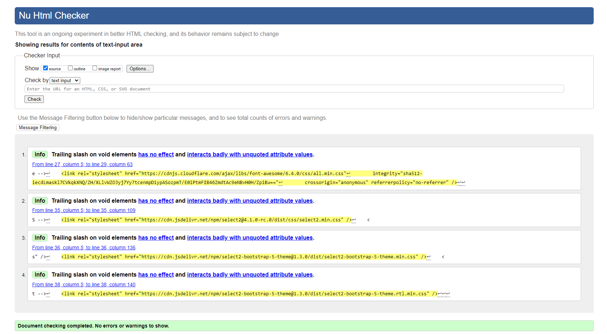  

All HTML pages were validated and received a 'No errors or warnings to show' result as shown above.

Initially, my Portfolio and Trade pages were receiving validator errors due to certain custom elements and Django-specific tags. I fixed these issues by ensuring proper nesting and closing of tags, re-deploying, and checking for any styling issues. All clear on re-validation thankfully.

| HTML Source Code/Page | Errors | Warnings |
| ---- | ------ | -------- | 
| Home | 0 | 0 |
| Sign In | 0 | 0 |
| Sign Up | 0 | 0 |
| Portfolios | 0 | 0 |
| Create Portfolio Modal| 0 | 0 |
| Edit Portfolio Modal | 0 | 0 |
| Delete Portfolio | 0 | 0 |
| Holding Details | 0 | 0 |
| Trade History | 0 | 0 |
| Add Trade | 0 | 0 |
| Edit Trade | 0 | 0 |
| Delete Trade | 0 | 0 |
| Coin List | 0 | 0 |
| Error 403 | 0 | 0 |
| Error 404 | 0 | 0 |
| Error 500 | 0 | 0 |

### JavaScript Validation

[JSHint](https://jshint.com/) was used to validate the JavaScript code added to the project. External JS files, such as those for Bootstrap purposes, obtained via [CDN](https://cdnjs.cloudflare.com/ajax/libs/bootstrap/5.2.3/js/bootstrap.min.js), were not validated through JSHint.

| File | Screenshot | Errors | Warnings |
| ---- | ---------- | ------ | -------- |
| auto_refresh.js | 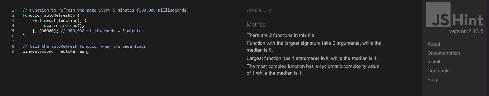 | none | none |
| create_portfolio.js | 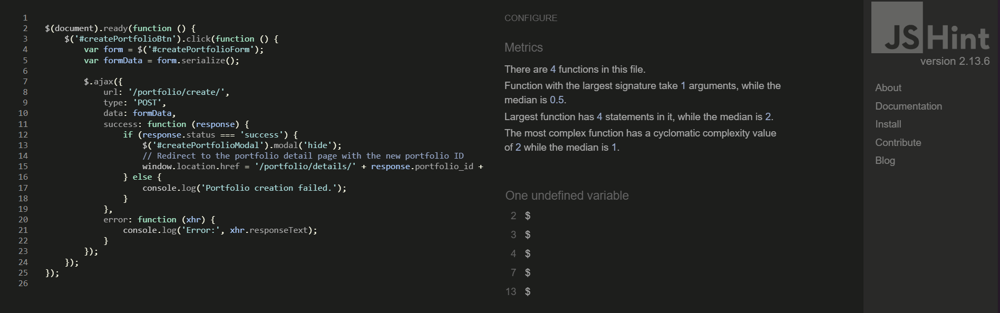 | none | none |
| edit_portfolio.js | 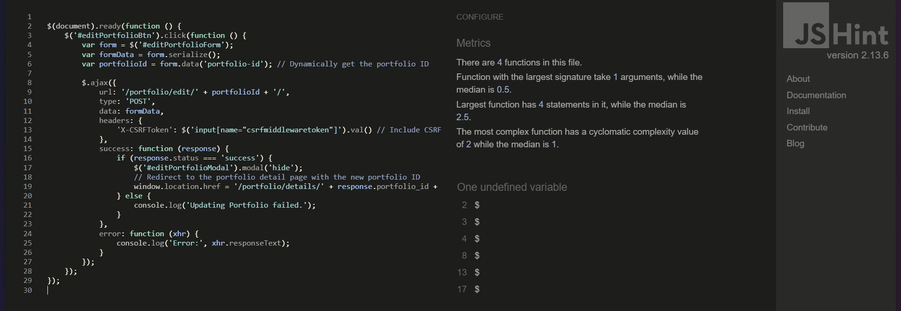 | none | none |
| message.js | 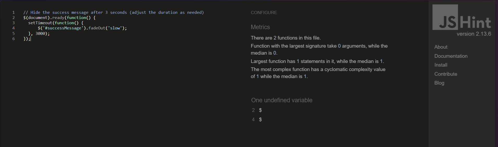 | none | none |
| portfolio_selector.js | 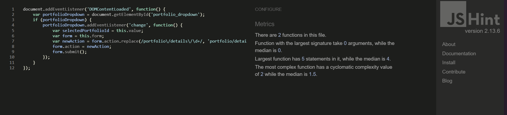 | none | none |
| select2.js | 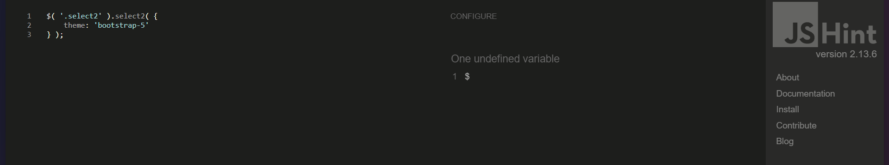 | none | none |
| trade_form.js | 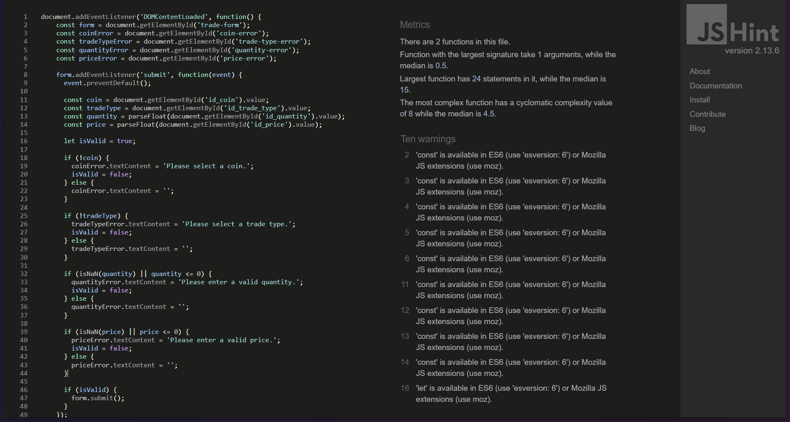 | none | 10 |

All JavaScript files were validated as shown in the screenshots above.

### Python Validation

[CI Python Linter](https://pep8ci.herokuapp.com/#) was used to validate the Python files that were created or edited by myself. No issues were presented, and line lengths were double-checked. Below is a screenshot with the results as an example.

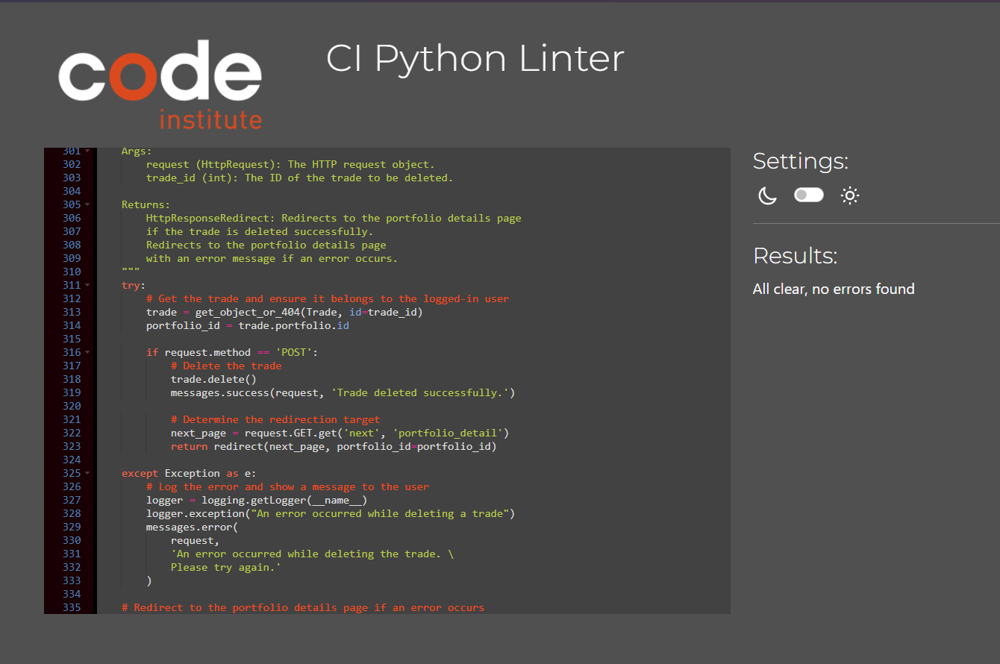

### CSS Validation 

[W3C CSS Validator](https://jigsaw.w3.org/css-validator/) was used to validate my CSS file. External CSS for Bootstrap, provided by [CDN](https://cdn.jsdelivr.net/npm/bootstrap@5.3.0/dist/css/bootstrap.min.css) was not tested. Warnings were present, these were related to my use of variables for colors and fonts in my CSS file.

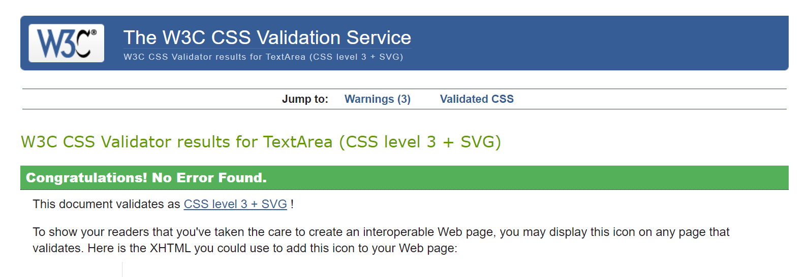
  

 

### Lighthouse Scores

Lighthouse testing was carried out in Incognito mode to achieve the best result. Performance was lower than preferred due to the site being image-heavy. Images used in the site's design were saved in WebP and PNG formats and compressed using [Convertio](https://www.convertio.co) to offer the best chance for a decent performance score. The CDNs used for Bootstrap were also noted in the Lighthouse report as causing issues with performance. This report will be reviewed for future development of CoinPilot to raise this score.

**Desktop**  

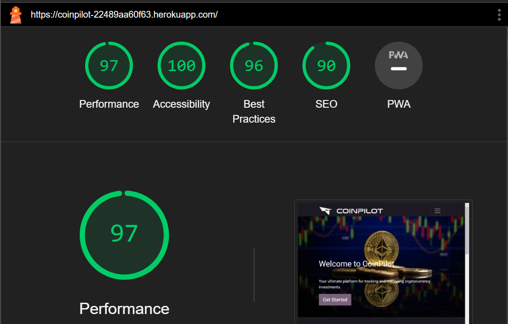  
*Desktop Home Page*

**Mobile**  

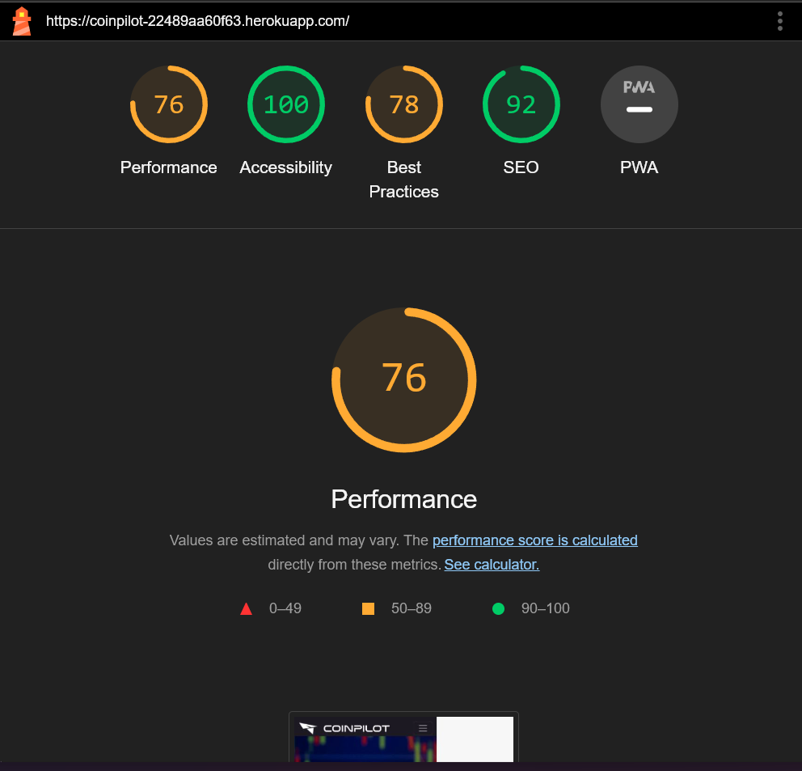 
*Mobile Home Page*

## Manual Testing

### User Input/Form Validation

Testing was carried out on desktop using a Chrome browser to ensure all forms take the intended input and process the input appropriately.

| Feature                               | Tested?  | User Input Required            | User Feedback Provided                                                                                   | Pass/Fail | Fix |
|---------------------------------------|----------|--------------------------------|----------------------------------------------------------------------------------------------------------|-----------|-----|
| Navbar Logo                           | Yes      | Click                          | Logo takes user to 'Home'.                                                                               | Pass      | -   |
| Navbar Buttons                          | Yes      | Click                          | Icons take user to intended location (Portfolios, About, Coin List, Login, Signup, Logout).              | Pass      | -   |
| Footer Icons                          | Yes      | None                           | Footer text displays the current year.                                                                   | Pass      | -   |
| Portfolio Dropdown                    | Yes      | Click                          | Dropdown allows selection of different portfolios.                                                       | Pass      | -   |
| Actions Dropdown                      | Yes      | Click                          | Dropdown provides actions like Add Trade, Trade History, Create Portfolio, Edit Portfolio, Delete Portfolio. | Pass      | -   |
| Create Portfolio Modal                | Yes      | Text input                     | Modal form for creating a new portfolio. 'Please fill out this field' if name is empty.                   | Pass      | -   |
| Edit Portfolio Modal                  | Yes      | Text input                     | Modal form for editing an existing portfolio. 'Please fill out this field' if name is empty.              | Pass      | -   |
| Portfolio Summary                     | Yes      | None                           | Displays summary information about the portfolio.                                                        | Pass      | -   |
| Holdings Table                        | Yes      | Click                          | Displays holdings information. Clicking a row navigates to holding details.                              | Pass      | -   |
| Success/Error Messages                | Yes      | None                           | Displays messages for user actions.                                                                      | Pass      | -   |
| Holding Summary                       | Yes      | None                           | Displays detailed information about a specific holding.                                                  | Pass      | -   |
| Trade History Table                   | Yes      | None                           | Displays the trade history for the selected holding.                                                     | Pass      | -   |
| Edit Trade Link                       | Yes      | Click                          | Link to edit a specific trade.                                                                           | Pass      | -   |
| Delete Trade Form                     | Yes      | Click                          | Form to delete a specific trade. 'Are you sure you want to delete this trade?' confirmation.              | Pass      | -   |
| Back to Portfolio Button              | Yes      | Click                          | Button to navigate back to the portfolio details page.                                                   | Pass      | -   |
| Hero Section                          | Yes      | None                           | Displays a welcome message and a call-to-action button.                                                  | Pass      | -   |
| Features Section                      | Yes      | None                           | Displays three features with icons and descriptions.                                                     | Pass      | -   |
| Call to Action Section                | Yes      | Click                          | Displays a sign-up prompt with a call-to-action button.                                                  | Pass      | -   |
| Add Trade Form                        | Yes      | Select/Text input              | Form to add a new trade. 'Please fill out this field' if any required fields are empty.                   | Pass      | -   |
| Edit Trade Form                       | Yes      | Select/Text input              | Form to edit an existing trade. 'Please fill out this field' if any required fields are empty.            | Pass      | -   |
| Trade History Filters                 | Yes      | Select/Date input              | Filters for coin, trade type, and date range.                                                            | Pass      | -   |
| Pagination                            | Yes      | Click                          | Pagination controls for the trade history table.                                                         | Pass      | -   |

### Testing User Stories

User Stories are documented in the CoinPilot [GitHub Projects Board](https://github.com/users/equaynor/projects/2). User Stories are numbered, with Acceptance Criteria and Tasks detailed within. Testing was carried out on Dev Tools for desktop/tablet/mobile, by creating multiple accounts for test users: CoinPilotTest1, CoinPilotTest2, CoinPilotTest3, etc., and ensuring that the Acceptance Criteria were met. All features were tested to ensure that they provided the user with the expected output and action.

| User Story                                     | Acceptance Criteria Met? | Tested | Response  | Pass/Fail | Fix |
|------------------------------------------------|--------------------------|--------|-----------|-----------|-----|
| User Authentication and Authorization: Register | Yes                      | Yes    | No issues | Pass      | -   |
| User Authentication and Authorization: Login    | Yes                      | Yes    | No issues | Pass      | -   |
| User Authentication and Authorization: Logout   | Yes                      | Yes    | No issues | Pass      | -   |
| Admin: Manage User Accounts                     | No                       | No     |     -     | Fail      | -   |
| Admin: Assign Roles                             | No                       | No     |     -     | Fail      | -   |
| View Supported Cryptocurrencies                 | Yes                      | Yes    | No issues | Pass      | -   |
| Admin: Add/Remove Cryptocurrencies              | No                       | No     |     -     | Fail      | -   |
| Create Portfolio                                | Yes                      | Yes    | No issues | Pass      | -   |
| View Portfolio Summary                          | Yes                      | Yes    | No issues | Pass      | -   |
| View Profit/Loss for Holdings and Portfolio     | Yes                      | Yes    | No issues | Pass      | -   |
| Update Portfolio Details                        | Yes                      | Yes    | No issues | Pass      | -   |
| Delete Portfolio                                | Yes                      | Yes    | No issues | Pass      | -   |
| View Holding Details                            | Yes                      | Yes    | No issues | Pass      | -   |
| Add Trade                                       | Yes                      | Yes    | No issues | Pass      | -   |
| View Trade History                              | Yes                      | Yes    | No issues | Pass      | -   |
| Update Trade Details                            | Yes                      | Yes    | No issues | Pass      | -   |
| Delete Trade                                    | Yes                      | Yes    | No issues | Pass      | -   |
| View Profit/Loss for Trades and Portfolio       | Yes                      | Yes    | No issues | Pass      | -   |
| Visually Appealing and Responsive UI            | Yes                      | Yes    | No issues | Pass      | -   |
| View Charts and Visualizations                  | No                       | No     |     -     | Fail      | -   |
| Access Cryptocurrency Market Data               | Yes                      | Yes    | No issues | Pass      | -   |

### Dev Tools/Real World Device Testing

Responsiveness testing was carried out using Google Dev Tools on the devices detailed within the below table. Responsiveness was evident on all features throughout all tested devices. Occassionally I would have to refresh the page by clicking the 'FreeFido' logo as the page would load zoomed in or out on the simualted device. When refreshed and CSS checked the desired outcome was observed. I put this down to a caching issue in Chrome as this issue was not observed when testing on the available real world devices.

**Dev Tools Device Testing - all features tested, issues noted below**
| Device  | Feature    | Issue  | Fix  |
| ------- | ---------- | ------ |------|
| iPhone 4 |  All features | No issues | None needed |
| iPhone12 Pro | All features | No issues | None needed |
| Samsung Galaxy A51 | All features | No issues | None needed |
| iPad Pro | All features | No issues | None needed |

**Real World Device Testing**
| Device  | Feature    | Issue  | Fix  |
| ------- | ---------- | ------ |------|
| Samsung Galaxy S24 | Navbar Toggler | Toggler moved below Navbar | no fix |
| Samsung Galaxy S22 | Navbar Toggler | Toggler moved below Navbar | no fix |
| Samsung Galaxy Tab S8+ | All features | No issues | None needed |

## Bugs

As this was my first Django/Database project, most of the bugs that I encountered were learning and teething issues. The below bugs are bugs that I spent a longer length of time investigating or required the assistance of Tutor Support.

| No. | Bug | Solved | Fix | Solution Credit |
| --- | ---- | ------ | --- | --------------- |
| 1   | Application error on Heroku | Yes | Updated procfile to say `coinpilot.wsgi` | - |
| 2   | InconsistentMigrationHistory: Migration `admin.0001_initial` is applied before its dependency `accounts.0001_initial` on database 'default' | Yes | Deleted the migration files and cleared migration history | - |
| 3   | ProgrammingError: relation `django_content_type` already exists | Yes | Flushed database | - |
| 4   | ProgrammingError: relation `accounts_customuser` does not exist LINE 1: ..."is_admin", "accounts_customuser"."username" FROM "accounts | Yes | First migrate then create superuser | - |
| 5   | Couldn’t sign up new users; error with creating new superuser | Yes | Flushed database, used `python manage.py migrate --run-syncdb` to apply all migrations from the beginning, created new superuser successfully, changed site domain in site settings, added username to sign up template | - |
| 6   | Placeholder text on login/signup not readable | Yes | Adjusted CSS for better readability | - |
| 7   | Server Error 500 on Coin-List page | Yes | Set up `REDISCLOUD_URL` in .env file | - |
| 8   | Coin Update management command not being triggered | Yes | Added call command to signal | - |
| 9   | Management command blocking response leading to 504 | Yes | Added threading to management command | - |
| 10  | `add_trade` function allowing for selling insufficient holdings | Yes | Exported holding management to holding view and wrote buy & sell strings in all caps, generating temporary trade object | - |
| 11  | Database overload after running app for too long | No | This issue has only occurred once, monitoring further | - |
| 12  | Logout success message partly behind navbar | No | Not yet fixed | - |
| 13  | Error message when filtering dates in trade history | No | Not yet fixed | - |
| 14  | Navbar Toggler moves below Navbar on small devices | No | Not yet fixed | - |

### Known Bugs

| 1  | Database overload after running app for too long | I went down this rabbithole and did not have time to investigate further.
| 2  | Logout success message partly behind navbar | Easy fix, but ran out of time
| 3  | Error message when filtering dates in trade history | Tried setting 'timestamp' to 'date' but that showed no results without error message
| 4  | Navbar Toggler moves below Navbar on small devices | Easy fix, but ran out of time 

There are currently no other known bugs, if you find one then please do let me know :smile: